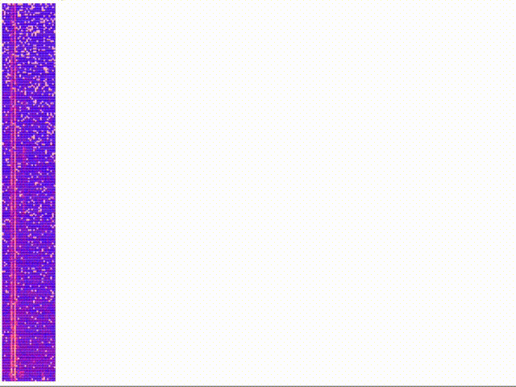

# Speech

An app that can currently visualize live audio data from the microphone, but
aspires to be more one day (speech recognition is hard!).

## Roadmap
Phase 0: Capture and display audio data

* [x] capture live microphone data
* [x] display live audio data as graph the browser
* [x] display live spectrogram (it's not as good as I'd like)
* [x] signal windowing before spectrogram
* [x] find ways to normalize fft results

-----

Phase 1: ML

* [ ] train neural network to detect presence of speech in audio samples
* [ ] send identified speech sample to Google for recognition
* [ ] alternatively do phoneme detection locally
* [ ] configurable utterance to function mapping (e.g. "next bus" or "weather tomorrow")

## Development workflow

Start the cljs/css watching process and open http://localhost:3000 with:

    boot frontend

Connect to a Clojure repl, open `user.clj` and run this code to start the
webserver and microphone capture components:

    (set-init! #'dev-system)
    (reset)

You should see a graph of live microphone data coming in through the websocket.

If you now call `(snd)`, you can display the current frame, the frame with the
hamming-window applied and the power spectrum (later being the same data as
columns in the spectrogram) as charts in the browser.

## TODOs
* [ ] add gif animation to readme
* [ ] refactor `app.cljs` to use multimethods for dispatching the message handler
* [ ] moves styles to the frontend
